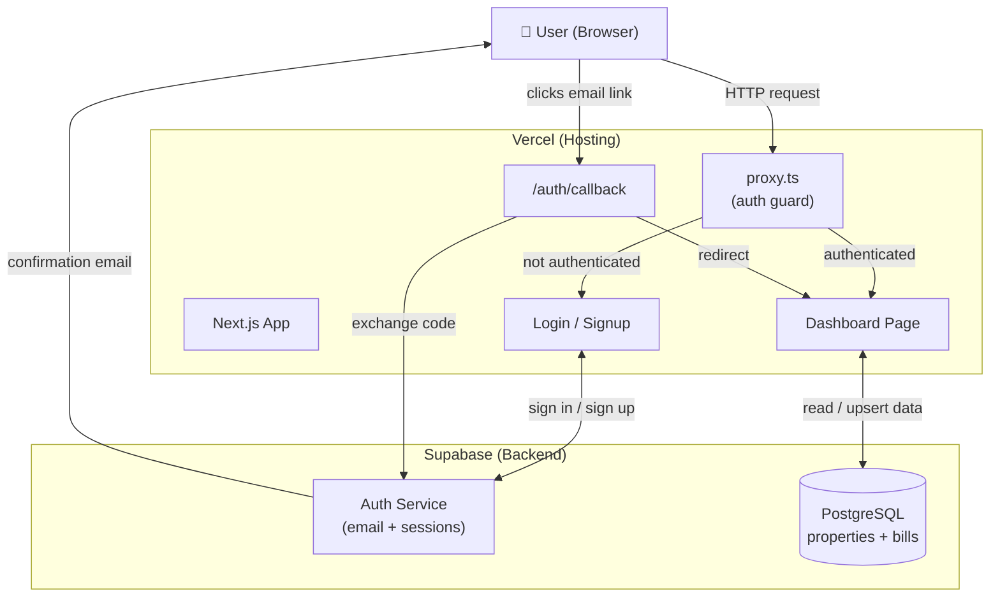
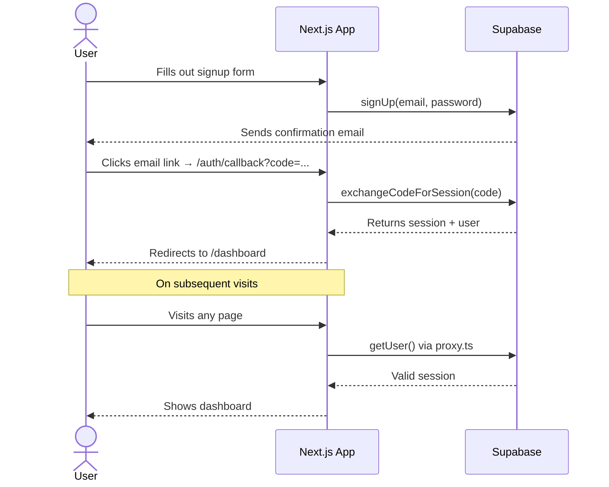
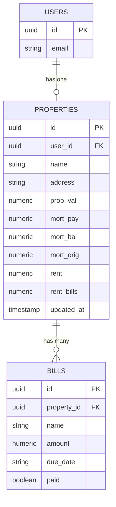
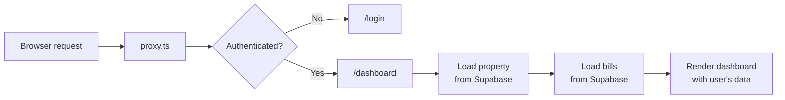

# Homeowner Dashboard — Architecture Overview

A web app where homeowners track their property finances: mortgage, equity, bills, and rental income. Each user has their own account and data.

---

## Tech Stack (TL;DR)

| Layer | Tool | Why |
|---|---|---|
| Framework | Next.js 16 (TypeScript) | Full-stack in one repo — handles pages, routing, and API routes |
| Database + Auth | Supabase (PostgreSQL) | Managed DB with built-in auth and row-level security |
| Styling | Vanilla CSS | Copied from the original prototype — clean, no framework needed |
| Deployment | Vercel | Zero-config deploys — push to `main`, it goes live automatically |

---

## System Architecture

How the three services fit together:



---

## Auth Flow

What happens when a new user signs up:



---

## Data Model

One property per user, with bills attached to that property:



> Row-level security (RLS) is enforced at the database level — a user can only ever read or write their own rows, even if someone crafted a direct API request.

---

## Request Flow (Page Load)

What happens on every page request:



---

## File Structure (Key Files)

```
app/
  dashboard/page.tsx     ← main page: state + Supabase reads/writes
  login/page.tsx         ← sign-in form
  signup/page.tsx        ← registration form
  auth/callback/route.ts ← handles email confirmation redirect
  globals.css            ← all styles (from original prototype)

proxy.ts                 ← auth guard on every request

lib/
  types.ts               ← shared types + default data
  supabase/client.ts     ← Supabase client for browser components
  supabase/server.ts     ← Supabase client for server components

components/
  PropertyHeader.tsx     ← property name, address, edit modal
  MetricsGrid.tsx        ← 4 overview cards (value, equity, cash flow, bills)
  MortgageCard.tsx       ← mortgage balance + progress bar
  EquityCard.tsx         ← SVG donut chart
  BillsList.tsx          ← monthly bills + add bill
  RentalCard.tsx         ← rental income breakdown
  SpendingChart.tsx      ← horizontal bar chart
  Modal.tsx              ← reusable modal wrapper
```

---

## Planned Next Steps

- **Vercel deploy** — connect GitHub repo, set env vars, get a live URL
- **Google + Apple sign-in** — OAuth via Supabase (Auth → Providers)
- **External data integrations** — Zillow (property value), utility APIs (bills), Google Calendar (due date reminders), mortgage servicer APIs
- **Multi-property support** — current model is one property per user
- **Analytics section** — re-add once real data sources are connected
